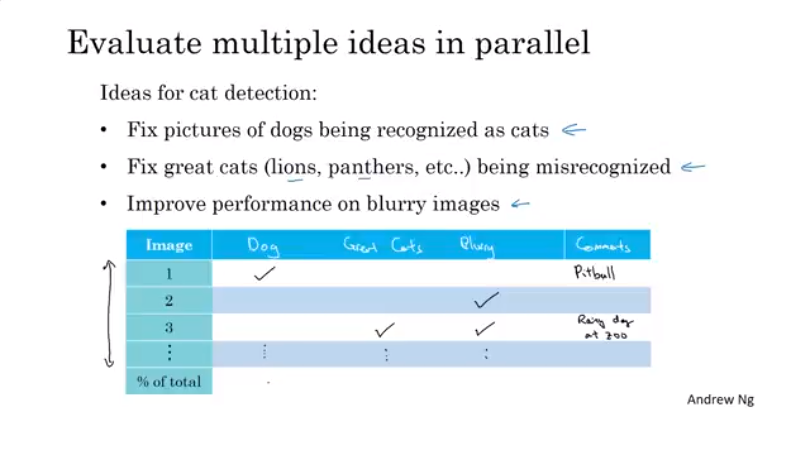
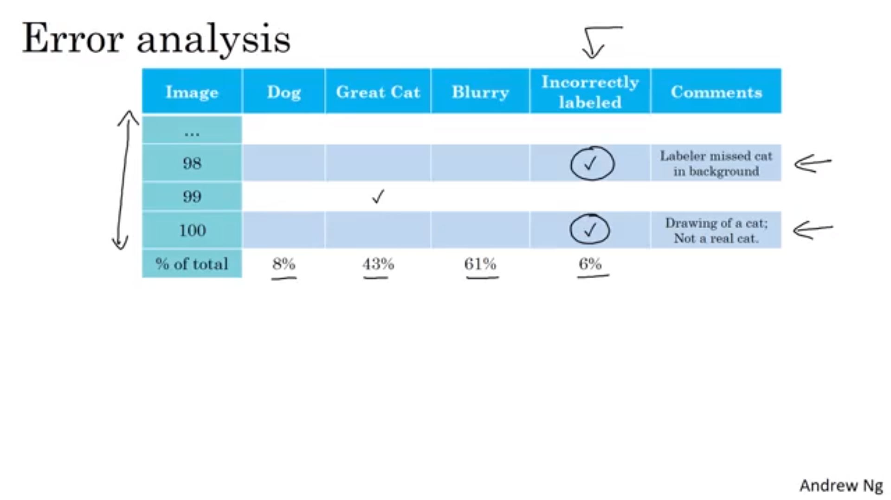
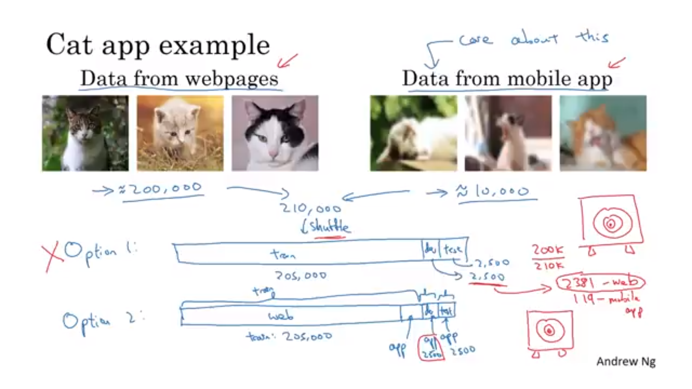
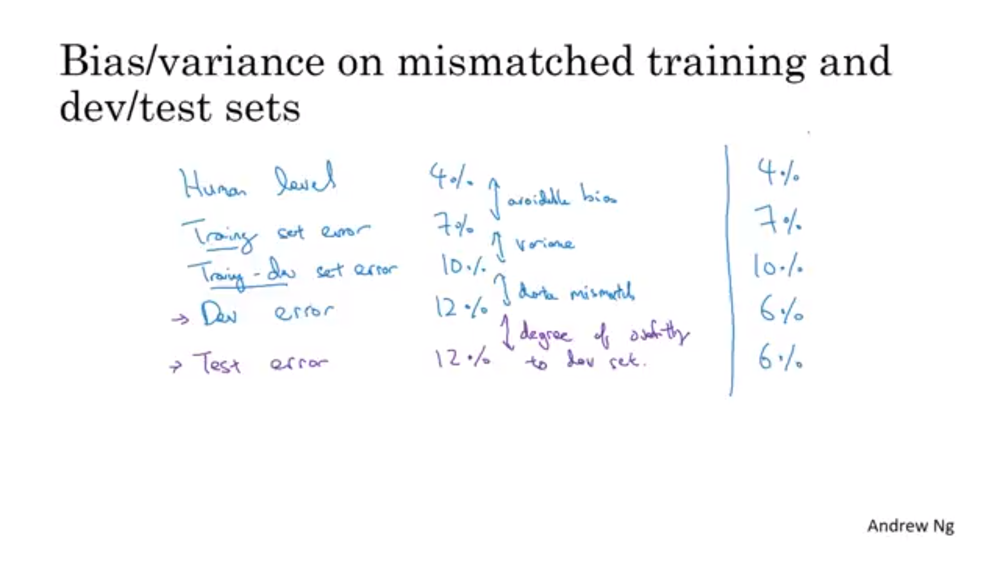
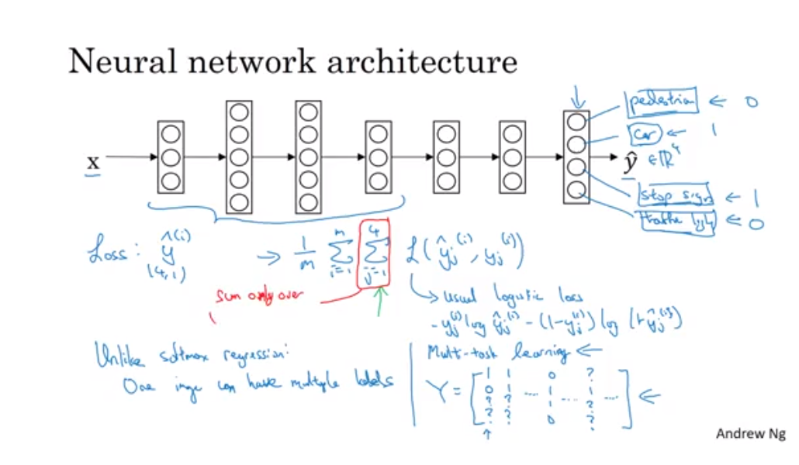
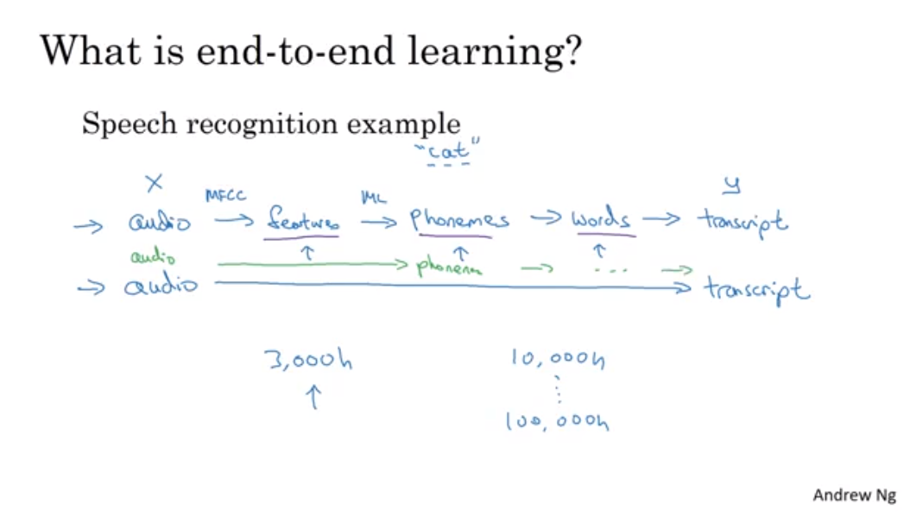

(From : deeplearningai 
https://www.youtube.com/watch?time_continue=386&v=AwQHqWyHRpU)

## 오차 분석
- 각 오차종류를 다루는 것
- 오차분석을 통해 알고리즘 수정의 방향을 정할 수 있음
- 아래와 같이 오차의 표로 정리해 놓으면 좋음
  

## 잘못 라벨링 된 데이터를 고치는 것(Cleaning)
- **딥러닝 알고리즘은 학습 세트의 무작위 오차에 대해서 다소 둔감** -> 일반적으로는 그냥 놔둬도 됨
- 알고리즘에 영향이 어느 정도 있다면 오차 분석에 써놓고 고치는데 시간을 쏟아야 함

- 지침
  - 학습, 검정, 테스트 셋에도 모두 적용할 것
  - 똑같이 예측한 것 중에서도 잘못된 것을 확인할 것
  - 학습 셋이 너무 크다면 검정, 테스트 셋의 데이터들만 고칠 것 

## 시스템을 먼저 만들고, 반복(검토)해라
- 1. 검증/테스트 셋, metric 정하기
- 2. 초기 시스템 빨리 만들기
- 3. Bias/Variance 분석 & 오차 분석을 통한 다음 step 우선 순위 정하기
- 새로운 알고리즘을 개발하는 것이 아니라 잘 작동하는 알고리즘을 만드는 것이라면 일단 모델을 만들고 해당 과정을 반복하길 바람

## 학습, 테스트 데이터가 다른 분포에서 얻어질 때
- 1. 다른 분포이면 데이터를 섞은 뒤 학습/검정/테스트 셋으로 나누는 것(비추천)
  - 장점 : 학습,테스트 데이터가 같은 분포
  - 단점 : 대부분의 시간을 데이터의 양이 많은 분포 쪽을 최적화 하는데 시간을 씀
- 2. 일부를 학습 데이터와 섞고 검정/테스트 셋은 적은 양의 분포였던 데이터를 쓰는 것
  
  - 단점 : 훈련, 테스트 셋의 분포가 다름
  - 장점 : 장기적인 성능은 더 좋음

- ex) 음성인식 예제
  - 다른 음성인식에서 얻은 데이터+ 해당 부품의 음성 데이터의 일부를 훈련 세트로 사용 가능

## 편향과 분산
- 학습-검정 셋 : 훈련 세트와 같은 분포를 가지지만 신경망의 학습에는 사용되지 않을 데이터
- 학습-검정 셋의 error를 통해 문제를 **분산, 데이터 불일치, 편향** 문제인지 알려줌

## 데이터 불일치 문제 
- 오차 분석으로 train/val/test 셋의 분포가 비슷한지 확인해야 함
- 분석 후 데이터가 비슷해지도록 만들거나 데이터를 더 수집해야 함
  - 데이터가 비슷해지도록 어떻게 하지? **인공 데이터 학습(Artificial data synthesis)

**인공 데이터 합성(Artificial data synthesis)**
  (1) 기존 신호에 노이즈 추가하는 것
    - 노이즈의 길이가 작으면 과적합할 수 있음. 노이즈를 늘려주기
    - 한계점은 인간의 귀에는 1만시간의 노이증가 같게 들린다는 것임
  (2) 컴퓨터 그래픽으로 부족한 사진 구현
    - 부족한 사진에 대해 과적합 발생 가능

## 전이학습
- 학습시킨 신경망을 다른 분야에도 적용하는 것
- 마지막 층을 초기화해서 새로운 데이터로 재학습
  - pretraining, fine-tuning : 재학습 층을 정하는 것
- 새로운 층을 추가해도 됨
- 전이학습이 잘 될 때?
  - 기존 학습데이터와 재학습 데이터가 같은 형식일 때(그림, 음성)
  - 기존 학습데이터가 많고, 이후 학습 데이터가 적을 때 

## 다중 학습(Multitask learning)
- 사진 상에서 표지판, 자동차, 신호등, 보행자 감지
  
  - 전체 훈련 세트에 대한 평균이 loss function임
  - 각 컴포넌트에 대한 값들을 더한 것
  - L은 일반적인 로지스틱 손실
  - 소프트맥스는 한 셈플에 한 레이블만 지정했지만 이것은 한 이미지가 여러 레이블을 가짐
  - 로지스틱 회귀와 다른 점은 각 레이블에 대한 손실을 더해줬다는 것
  - 각각을 따로 찾는 신경망을 만들 수 있지만 신경망의 초기 특성들은 공유되기 때문에 같이 찾는 신경망을 쓰면 더 성능이 좋게 된다.
  - 레이블이 모르는 것이 있어도 학습할 수 있다. 라벨 된 것에 대해서만 loss function을 구하면 된다. 라벨이 안된 것(그림에서 물음표)에 대해서는 loss function 계산을 안하면 된다.
- 언제 잘될까?
  - 낮은 특성을 공유할 때 이익을 얻을 수 있는 경우
  - 일반적으로 각 작업이 가지고 있는 데이터 양이 비슷하다.
    - 다른 task에 대해서 해당 데이터 만큼의 양이 있기 때문에 부스팅을 해 줄 수 있다.(어렵)
  - 모든 작업에 대해서 충분히 큰 신경망을 훈련할 수 있어야 함
- 많은 데이터 작업 세트가 있어야지 되므로 전이학습보다 적게 사용됨
- 여러 물체를 동시에 감지하는데 많이 쓰임

## End-to-end Deep learning
- 많은 중간 단계(파이프라인)를 삭제하고 바로 x에서 y가 나오는 과정

- 사전에 많은 정보가 필요함
- 즉 데이터가 적을 수록 기존 파이프라인 방식이 더 잘되며, 데이터가 많을 수록 end-to-end 방식이 잘 작동. 중간급의 데이터가 있으면 일부 과정을 생략해도 잘됨
- 단계를 나누는 것이 일을 더 간단하게 만들 수 있음
- 기계 번역에는 end-to-end 방식이 더 잘 됨
  - 많은 양의 (x,y) 쌍을 얻을 수 있기 때문
- **장점**
  - 데이터가 직접 말하게 함 x->y
  - 중간 요소설계를 적게 해도 됨
- **단점**
  - 많은 양의 데이터가 필요함
  - 도움이 될 수도 있는 사람이 만든 컴포넌트를 무시함
- 어떤 케이스에는 효율적일 수 있지만 일반적으로는 효율적이지 못함, 여러 논리적인 단계별로 나눠서 학습하는게 더 성능이 좋음(Motion planning)