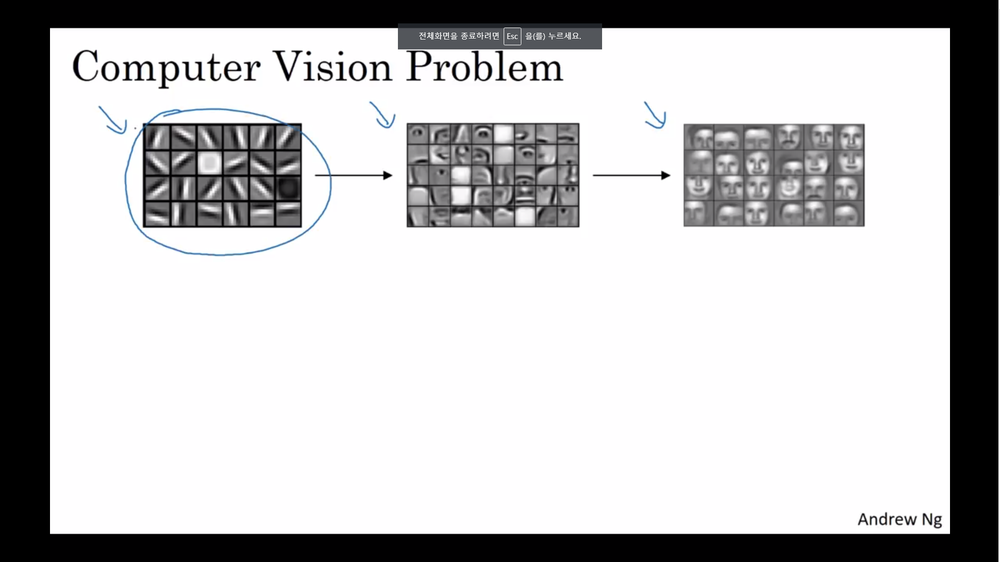
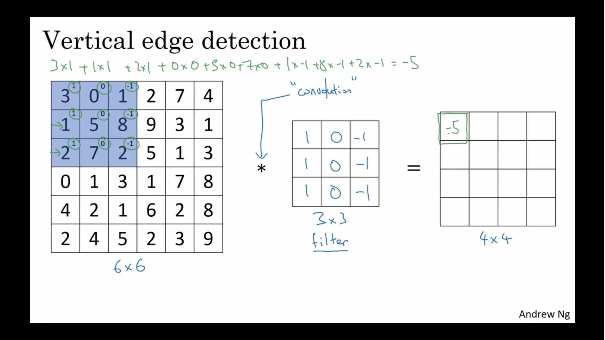
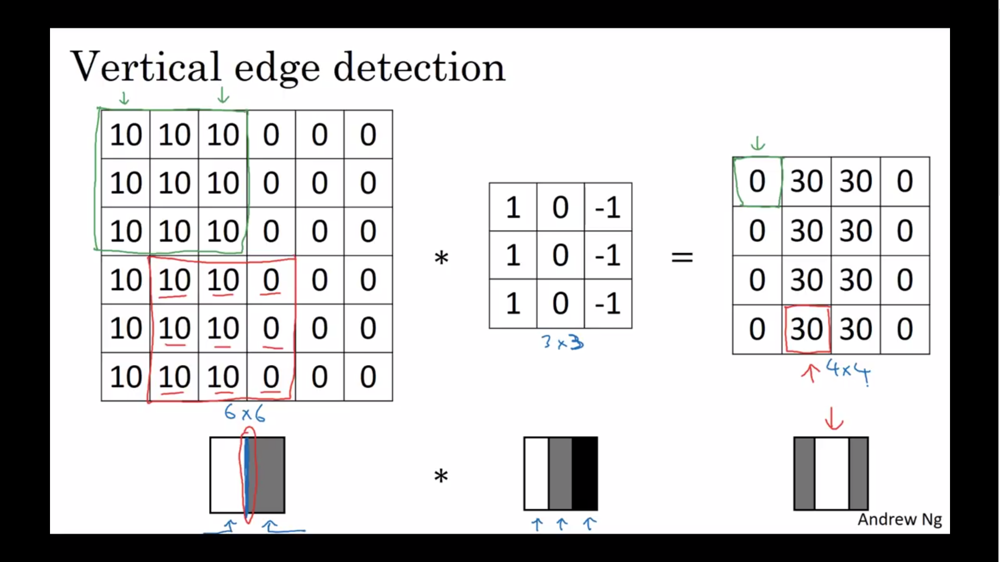

(From : deeplearningai 
https://www.youtube.com/watch?time_continue=386&v=AwQHqWyHRpU)

## Computer vision
- 딥러닝의 발전과 같이 발전중인 분야
- 이미지 분류, 물체 인식, 사진 스타일 전환(Neural Style Transfer) 등등
- 컴퓨터 비전에서의 딥러닝의 발전이 기대가 되는 이유
  - 빠른 발전이 많은 새로운 어플리케이션을 만들어지게 함
  - 컴퓨터 비전 시스템을 구축하지 않아도 서로 신경망 구조와 알고리즘에 많은 영감을 줌.
    - ex) 음성인식 시 컴퓨터 비전의 개념 사용
- 이미지 인식에서의 딥러닝
   - 이미지 해상도에 따라서 node의 수가 기하급수적으로 많아질 수 있음
   - 이를 해결한 것이 **합성곱 연산** 

## Edge Detection
- **일반적인 이미지 인식 과정**- 갈수록 더 복잡한 특징을 인지

- 합성곱 신경망을 거친 후 이미지의 수직, 수평 모서리가 인식됨
- 이번강의에서는 신경망의 하위층이 모서리와 선을 어떻게 인식하는지에 대해서 배움
  
- 이미지에 정사각형의 필터(커널)을 합성곱해줌
  - ${*}$ 의 의미 : 수학에서는 곱셈, 파이썬 에서는 성분곱
  - python : Conv-forward
  - tensorflow : tf.nn.conv2d
  - Keras : Conv2D
- 이것이 바로 수직 모서리를 인식하는 원리
- 보다 자세한 설명은 아래 그림을 보면 알 수 있다.
  
- 모서리의 스케일의 차이가 있지만, 실제로 엄청 큰 이미지에 대해서 진행하면 꽤나 정교한 수직 경계선을 찾을 수 있다.
- Sobel Filter, Scharr Filter (중간부분에 더 초점을 둠)
- 딥러닝을 하면 파라미터는 자동으로 학습됨

## Padding
- 합성곱 계산시 행렬이 줄어드는 것을 방지하고자 하는 것
- 이미지 가장자리의 정보를 고려하고자 하는 것 
- 가장자리에 0으로 된 층을 덧대는 것
- **Valid Convolution** : padding 없는 것
- **Same Convolution** : 입력 이미지와 같게 padding하는 것
  - $p=\frac{f-1}{2}$
- 컴퓨터 비전에는 필터가 보통 홀수, padding을 비대칭으로 만들지 않기 위해서임

## Strided convolution
- 합성곱을 얼마나 이동하면서 계산할 지 정하는 것 
- n X n image, f X f filter, padding p, stride s 일때
  - $[\frac{n+2p-f}{2}+1]$ X $[ \frac{n+2p-f}{2}+1]$ 