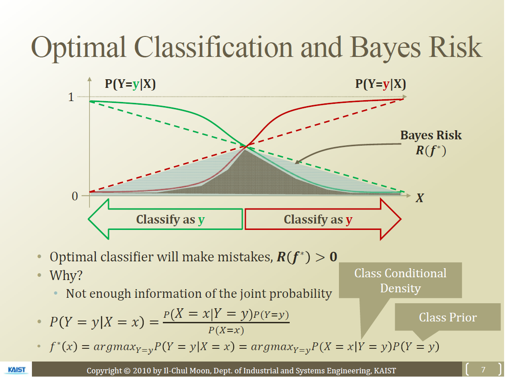
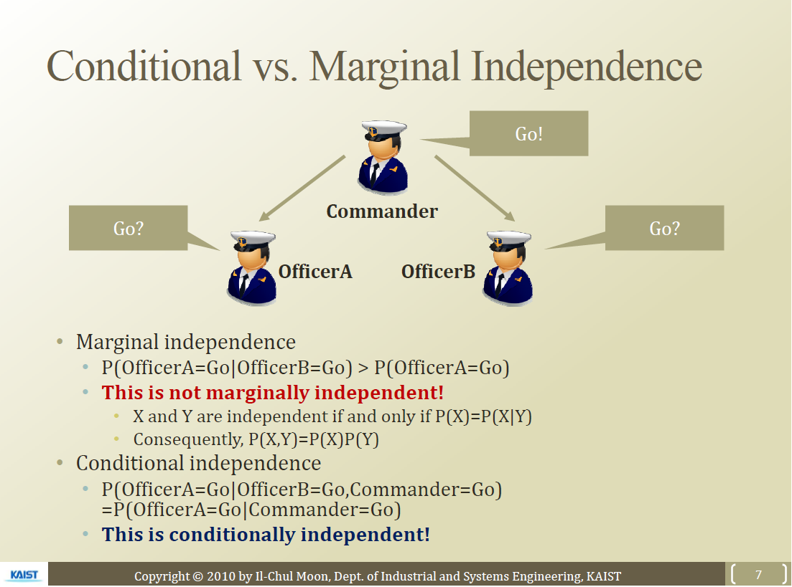

참고- 문일철 교수님 유튜브-AAiKaist \
(https://www.youtube.com/watch?v=sDG1Y1vxOjs&list=PLbhbGI_ppZISMV4tAWHlytBqNq1-lb8bz&index=2)

(새롭게 알게된 정보들만 자세히 기술, 나머지 내용들은 간략하게 정리함)

## Naive Bayes Classifier
- 성능도 좋고, 입문하기에 좋은 통계 모델

### Optimal Classification
- **Bayes Classifier**
  - Error을 제일 줄이는 Optimal Classifier
$$f'=argmin_f P(f(X)\neq Y)$$
  - 두 종류를 clasifier하는 것일시에는
$$f'=argmax_{Y=y} P(Y=y|X=x)$$

- 분류에서는 실선이 점선보다 더 좋음
  - 선형으로 되어 있으면 확률차이가 별로 크지 않음
  - error는 잘못 판별된 부위 면적에 해당됨
  - 실선 부분의 error가 더 작음
  - Decision Boundary(중점)에 대해서 높은 확률 차이로 두 class를 분류해줌
  - 위와 같은 실선 부분의 error를 줄이기 위해서 많은 방법들이 있음(ex. logistic function)
- Optimal Classifier은 다음과 같이도 표현 가능
$$f'=argmax_{Y=y} P(Y=y|X=x)$$
$$f'=argmax_{Y=y} P(X=x|Y=y)P(Y=y)$$
  - Prior : 경험 정보, 데이터에서도 취득 가능
  - Likelihood=Class Conditional Density : True인 값(Y=y)들의 확률을 계산해서 Conditional Density를 만들 수 있음
- 여러 variable 간의 Interection을 모두 존재하며 이에 따라 변수값이 엄청 많아짐
- 이러한 Interaction을 무시하는 것이 **Naive Bayes filter**

## Naive Bayes Classifier
- 아래 조건을 풀기 위해서는 너무 파라미터의 수가 많음($(2^d-1)k$)
$$f'=argmax_{Y=y} P(Y=y|X=x)$$
- 추가적인 조건을 걸어줘야 함

### Conditional Independence
- 아래와 같이 조건부 확률을 다음과 같이 해당 조건에서 독립으로 정의하는 것
$$P(X = <x_1, \cdots , x_t >|Y=y) = \Pi_i P(X_i=x_i|Y=y)$$
- 따라서 y조건에서 x변수 사이에는 다음과 같은 관계가 성립함
  $$P(x_1,x_2|y)=P(x_1|y)P(x_2|y)$$

### Marginal Independence vs Conditional Independence
- 자기가 소리르 들으면 앞으로 가나 못들으면 옆의 사람 눈치를 보고 앞으로 가는 사람(예시)

- Y가 관측이 되어 있으면 X1, X2에는 서로의 영향을 주지 않는다
- Y정보가 없으면 X1, X2는 서로 영향을 준다.
$$P(X)=P(X|Y)$$
$$P(X=x1|Y=y)=P(x=x1|y=y,X=x2)$$
- 즉 Marginally independent 하지 않더라도 Conditionally independent할 수 있다.

### **Conditional Independence**를 적용할 때
$$f'=argmax_{Y=y} P(X=x|Y=y)P(Y=y)$$
$$ \approx argmax_{Y=y}P(Y=y)\Pi_{1\leq i \leq d} P(X_i=x_i|Y=y)$$
- 이게 실제로는 맞지 않음
- 너무 많은 파라미터 러닝을 없애기 위해서 만든 것일 뿐
- Assumption이 순진하군~
- 이를 **Naive Bayes Classifier**라고 부름

### Naive Bayes Classifier
- **Naive Bayes Classifier Function**
$$f_{NH}(x) = argmax_{Y=y} P(Y=y)\Pi_{1\leq i \leq d} P(X_i=x_i|Y=y)$$
- 만들기가 쉬움
- 쉬운만큼 문제점도 존재함
  - Naive Assumption의 문제
  - Incorrect Probability Estimation시 성능이 안좋음(모든 Classifier의 문제이기도 함)
    - MLE나 MAP에 대해서 진행해야 됨
- **주의** : 컴퓨터 계산시 변수가 많으면, 곱하면서 확률 값이 0에 가까워져서 0으로 인식할 수 있음, log 로 계산 진행하는 것이 더 좋음
- P(X|Y)를 유지하면서 classification을 진행하는 모델이 있는데(Logistic Regression)이를 다음 시간에 다룰 것 